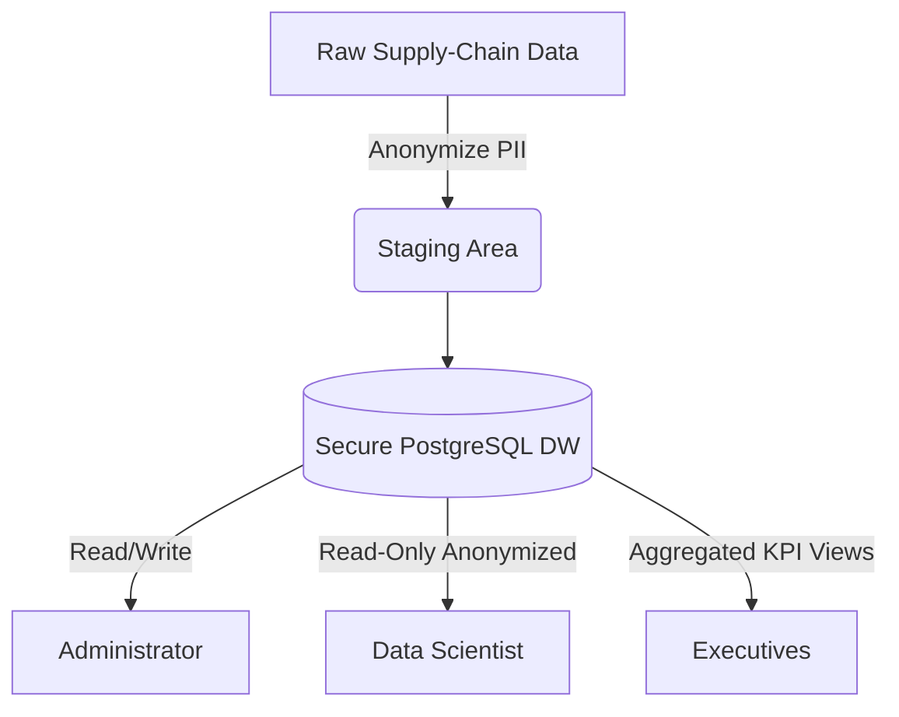

# Aurora Tech - Bloc 1: Data Governance

## Overview
This repository contains the official deliverables for Bloc 1 of the Aurora Tech project. This module establishes a robust Data Governance framework specifically tailored to secure and manage supply-chain and financial data used for margin risk prediction.

## Deliverables
1. **`Data_Governance_Plan.html`**: The complete 8-10 page written Data Governance Policy. Open this file in your browser to review the official documentation.
2. **`Executive_Presentation.html`**: A 10-slide interactive presentation designed for the 15-minute executive defense. Open in your browser for a slideshow experience.

## Architecture Diagram (RBAC & Data Flow)

## Evaluation Criteria Met & Addressed
- **Stakeholder Alignment**: We clearly define the roles of CDO, Data Stewards, Data Owners, and Consumers to ensure accountability across finance and logistics.
- **Regulatory Compliance (GDPR/CCPA)**: Addressed via strict data minimization (PII removal) and automated anonymization before data enters the ML pipeline.
- **Data Quality (DataOps)**: Defined thresholds (99.9% completeness) and fallback strategies (e.g., 7-day moving averages for missing FX rates).
- **Security & Authorization**: Implemented a comprehensive Role-Based Access Control (RBAC) matrix separating Administrative, Data Science, and Executive access.

## Potential Risks & Mitigation Strategies
- **Risk: Unauthorized Access to Financial Macros**: Mitigated through strict RBAC, limiting view privileges to anonymized warehouse facts for non-admin users.
- **Risk: Vendor Data Leakage**: Mitigated via AES-256 encryption at rest in our PostgreSQL instances and TLS encryption in transit.
- **Risk: Poor Data Lineage**: Mitigated by our standardized data dictionary and Airflow logging requirements set forth in the governance policy.

## Instructions for the Jury
Please open `Data_Governance_Plan.html` to review the written policies, followed by `Executive_Presentation.html` to review the defense presentation structure.
