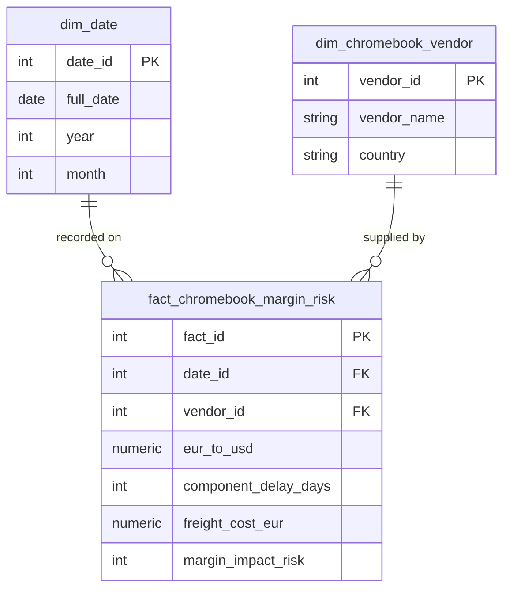

# Aurora Tech - Bloc 2: Data Architecture

## Overview
This module contains the Infrastructure as Code (IaC) and Data Architecture design for Aurora Tech's enterprise data warehouse. The architecture provides a reproducible, secure, and performant storage layer capable of handling high-volume daily ingestions and serving complex analytical queries to our AI solutions.

## Architecture Highlights
- **Storage:** PostgreSQL 15 (Alpine) containerized for lightweight, reproducible deployment.
- **Model:** Star Schema strictly enforcing isolated dimensions (Vendors, Dates) against a central Margin Risk Fact Table.
- **Deploy:** Managed via Docker Compose and Terraform.

## Directory Structure
- `/docker`: Contains compose configurations (`docker-compose.yml`) and DDL initialization scripts (`init.sql`).
- `/terraform`: AWS RDS infrastructure provisioning templates (`main.tf` etc).
- `/scripts`: Utility scripts for CI/CD automation (`deploy.sh`).

## How to Run & Deploy
Run the following script to deploy locally using Docker:
```bash
bash ./scripts/deploy.sh
```

Or deploy directly via docker-compose:
```bash
cd docker
docker-compose up -d
```

## Star Schema Diagram



## Evaluation Criteria Met & Addressed
- **Infrastructure as Code (IaC)**: Adopts Docker Compose for a completely reproducible, containerized environment preventing "works on my machine" issues.
- **Relational Data Modeling**: Implements a highly optimized Star Schema centered on `fact_chromebook_margin_risk`, linking to critical time (`dim_date`) and vendor (`dim_chromebook_vendor`) dimensions.
- **Storage Resilience & Monitoring**: Integrates natively with Grafana to monitor container health, CPU, and IOPS, ensuring the database does not bottleneck during Extract/Load operations.

## Potential Risks & Mitigation Strategies
- **Risk: Container Data Loss on Restart**: Mitigated by implementing persistent Docker Volumes (`postgres_data`) in the `docker-compose.yml` to preserve the warehouse state across container restarts.
- **Risk: Slow Query Performance for ML Models**: Mitigated by the Star Schema design, which denormalizes analytical data to reduce complex joins during AI feature extraction.
- **Risk: Port Conflicts during Deployment**: Standardized mapping to 5432 (Postgres), 5050 (pgAdmin), and 3000 (Grafana) with instructions to ensure ports are free prior to `docker-compose up`.

## Instructions for the Jury
1. Open `Infrastructure_Plan.html` for the architectural defense.
2. Review the `docker-compose.yml` and `init.sql` for technical implementation details.
3. Check `Demo_Video.txt` for the recorded deployment demonstration.
