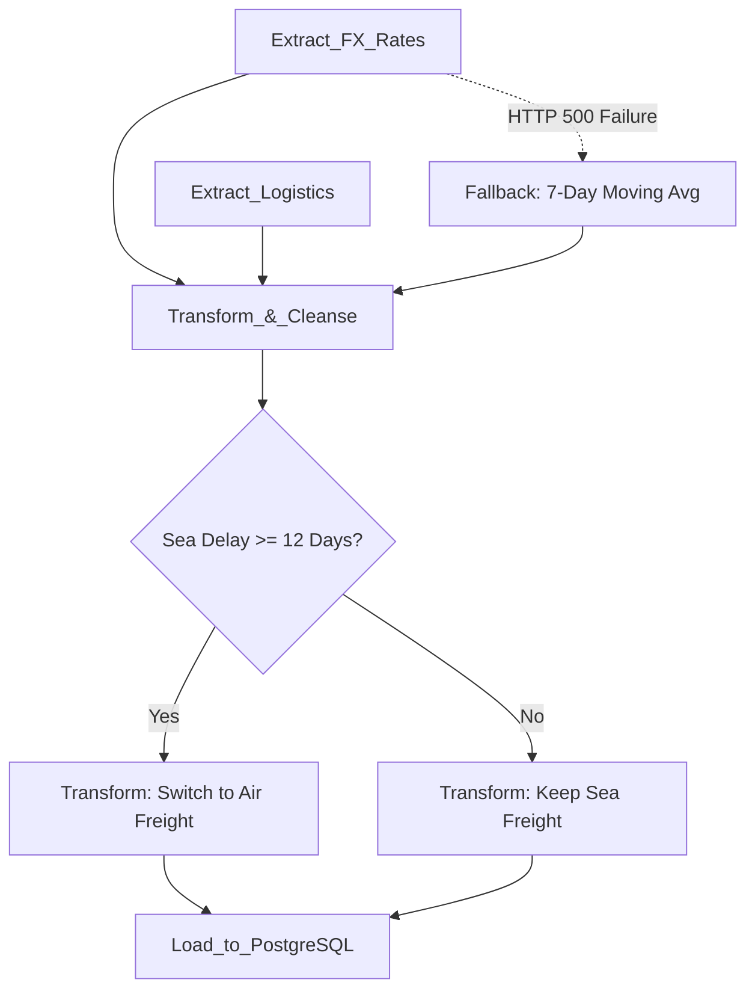

# Aurora Tech - Bloc 3: Real-Time Data Pipelines

## Overview
This repository contains the ETL (Extract, Transform, Load) pipeline deliverables orchestrated by Apache Airflow. The pipeline bridges our external data sources (FX APIs and Logistics Telemetry) with our Dockerized Data Architecture from Bloc 2.

## Deliverables
1. **`Pipeline_Plan.html`**: The interactive presentation defining the ETL architecture, extraction strategies, transformation logic, and observability.
2. **`dags/auroratech_pipeline.py`**: The fully self-contained Python source code defining the Airflow DAG, tasks, and PythonOperator functions.
3. **`Demo_Video.txt`**: Contains the URL to the Loom screencast verifying the Airflow web UI and a successful execution run.

## Pipeline DAG Architecture Diagram

## Evaluation Criteria Met & Addressed
- **Automated Orchestration**: Utilizes Apache Airflow to schedule and manage dependencies safely (Extraction -> Transformation -> Load).
- **Multi-Source Extraction**: Combines real-time financial API calls (Frankfurter EUR/USD) with simulated supply-chain telemetry (shipping delays).
- **Business Logic Integration**: Implements the complex "Ocean-to-Air" transformation logic natively in Python to adapt transport modes based on sea delay thresholds.
- **Data Quality & Observability**: Incorporates resilient error handling to fallback to historical averages when external APIs fail.

## Potential Risks & Mitigation Strategies
- **Risk: Upstream API Failures (e.g., Frankfurter API 500 Error)**: Mitigated by a Try/Except block in the Airflow task that automatically falls back to a 7-day moving average, guaranteeing zero data downtime for the downstream warehouse.
- **Risk: Task Dependency Failures**: Mitigated by strict Airflow DAG topology (e.g., `extract >> transform >> load`), ensuring downstream tasks never execute on incomplete data.
- **Risk: Duplicate Data Loading**: Mitigated by utilizing idempotent SQL inserts and Airflow's native `execution_date` context to prevent re-ingesting the same daily batch twice.

## Instructions for the Jury
1. Open `Pipeline_Plan.html` to review the defense strategy.
2. Inspect the Python code in `dags/auroratech_pipeline.py` to evaluate the Airflow logic.
3. Consult `Demo_Video.txt` for the execution demonstration.
