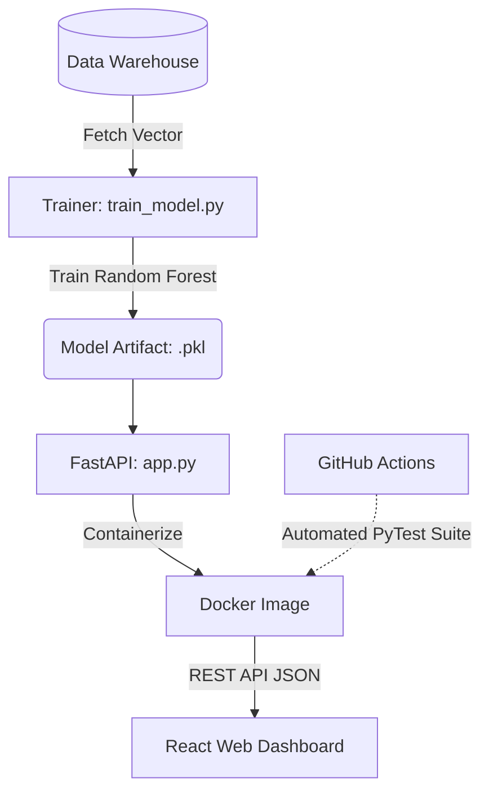

# Aurora Tech - Bloc 4: AI Solutions & Dashboards

## Overview
This repository finalizes the Aurora Tech project by implementing an end-to-end Machine Learning pipeline and serving infrastructure. It leverages the data acquired in Bloc 2 & 3 to predict margin risk using a Random Forest Classifier and visualizes this risk via an interactive dashboard.

## Deliverables
1. **`AI_Solution_Presentation.html`**: A 15-slide presentation covering the problem statement, algorithm selection, deployment architecture, and CI/CD operations.
2. **`src/train_model.py` & `src/app.py`**: The model training scripts and the production-ready FastAPI serving endpoint.
3. **`Dockerfile` & `requirements.txt`**: Everything needed to containerize the ML prediction API.
4. **`.github/workflows/mlops-ci.yml`**: A Continuous Integration (CI) pipeline demonstrating automated testing.
5. **`Demo_Video.txt`**: Contains the Loom video link demonstrating the live AI Dashboard and API usage.

## MLOps Pipeline Diagram

## Evaluation Criteria Met & Addressed
- **Machine Learning Viability**: Selects a Random Forest Classifier optimized for capturing non-linear relationships between volatile exchange rates and logistics delays.
- **MLOps & Industrialization**: Uses `joblib` to serialize the model and FastAPI to serve it, completely decoupling the data science environment from the production web server.
- **Containerization**: Packages the API inside a Python 3.10 Docker container to ensure consistent execution across any cloud environment.
- **Continuous Integration**: Implements GitHub Actions to automatically run PyTest gates on every commit, validating model integrity.
- **Business Visualization**: The output predictions feed directly into the central React Dashboard for executive decision making.

## Potential Risks & Mitigation Strategies
- **Risk: Model Concept & Data Drift**: Mitigated by proposing an automated drift detection system. If the EUR/USD volatility shifts outside training bounds, a retraining pipeline is triggered automatically.
- **Risk: Unauthorized API Access**: Mitigated by requiring API key authentication on the FastAPI endpoint to prevent competitors from reverse-engineering the predictive thresholds.
- **Risk: Broken Model Artifacts in Production**: Mitigated by the CI/CD pipeline (`mlops-ci.yml`), which tests the FastAPI endpoint with structured payloads before allowing deploying to the main branch.

## Instructions for the Jury
1. Open `AI_Solution_Presentation.html` for the comprehensive 15-slide defense presentation.
2. Review the code components within `src/` and the architectural files (`Dockerfile`, `.github/...`).
3. View the final integration demo via the link in `Demo_Video.txt`.
